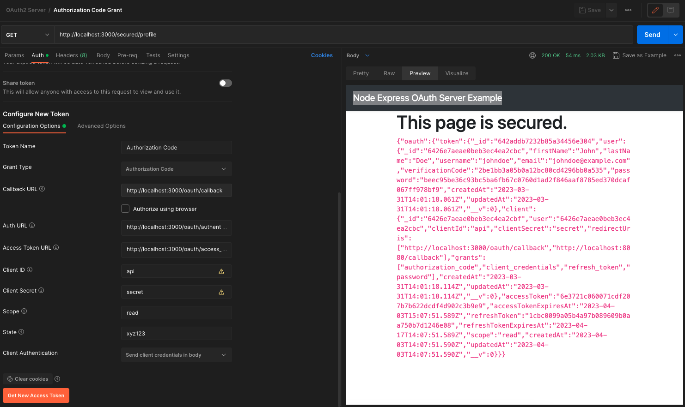
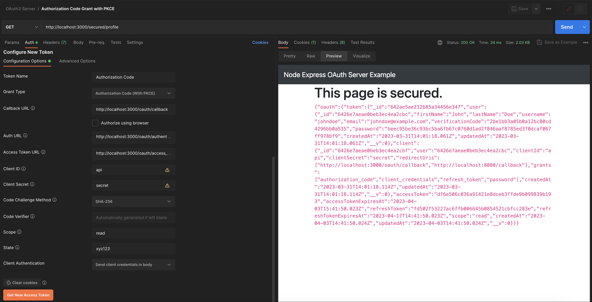
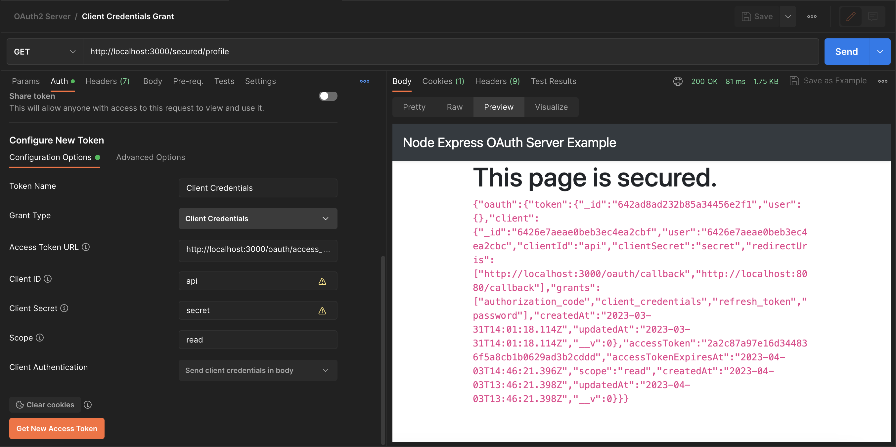
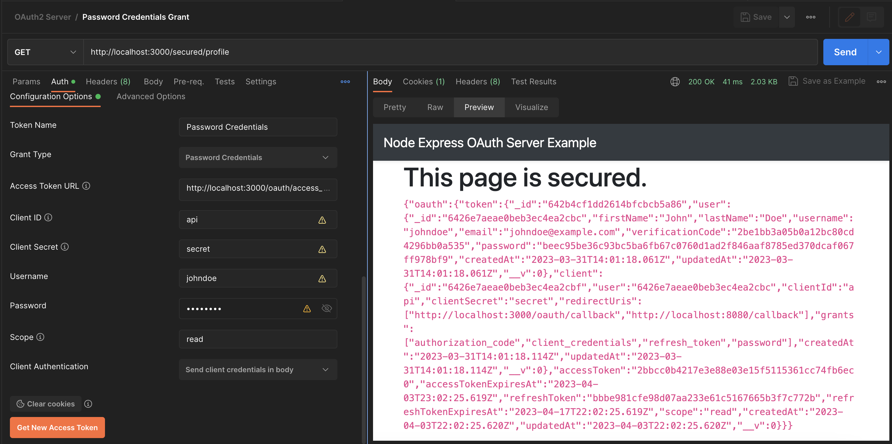

# Express JS OAuth2 Server using oauth2-server package

This project is an updated interpretation of teh sample OAuth2 Server application code for the post [Express JS OAuth 2 Server using oauth2-server package](https://niceprogrammer.com/express-js-oauth-2-server-using-oauth2-server-package/)

About OAuth 2.0 grant flows: [Which OAuth 2.0 grant should I implement?](https://oauth2.thephpleague.com/authorization-server/which-grant/)

Another interesting post:
[Step-by-Step: How to Implement OAuth2 Server in ExpressJS](https://merlino.agency/blog/step-by-step-how-to-implement-oauth2-server-in-expressjs)


### To test it:

1. Set Mongo DB database in [app.js](app.js) line 41

2. Run server: `npm run start`

2. Create a user and an oauth client for that user from 
    http://localhost:3000/register

    - users collection
    ```
        {
        "_id": {
            "$oid": "6426e7aeae0beb3ec4ea2cbc"
        },
        "firstName": "John",
        "lastName": "Doe",
        "username": "johndoe",
        "email": "johndoe@example.com",
        "verificationCode": "2be1bb3a05b0a12bc80cd4296bb0a535",
        "password": "beec95be36c93bc5ba6fb67c0760d1ad2f846aaf8785ed370dcaf067ff978bf9",
        "createdAt": {
            "$date": "2023-03-31T14:01:18.061Z"
        },
        "updatedAt": {
            "$date": "2023-03-31T14:01:18.061Z"
        },
        "__v": 0
        }    
    ```

    - oauth_clients collection
    ```
        {
        "_id": {
            "$oid": "6426e7aeae0beb3ec4ea2cbf"
        },
        "user": {
            "$oid": "6426e7aeae0beb3ec4ea2cbc"
        },
        "clientId": "api",
        "clientSecret": "secret",
        "redirectUris": [
            "http://localhost:3000/oauth/callback",
            "http://localhost:8080/callback"
        ],
        "grants": [
            "authorization_code",
            "client_credentials",
            "refresh_token",
            "password"
        ],
        "createdAt": {
            "$date": "2023-03-31T14:01:18.114Z"
        },
        "updatedAt": {
            "$date": "2023-03-31T14:01:18.114Z"
        },
        "__v": 0
        }
    ```

3. Test from Postman
    - Authorization Code Grant
    
    
    - Authorization Code Grant with PKCE
    

    - Client Credentials Grant
    

    - Password Credentials Grant
    


Enjoy!